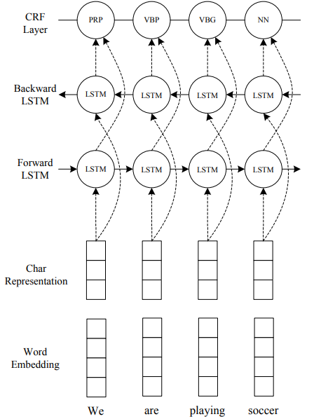
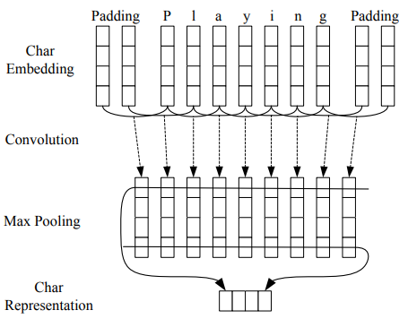

Name Entity Recognition
========================
Here are some papers for NER.

## End-to-end Sequence Labeling via Bi-directional LSTM-CNNs-CRF (https://www.aclweb.org/anthology/P16-1101)
* Overview:
	* A novel neutral network architecture that benefits from both `word- and character-level representations` automatically, by using combination of bidirectional LSTM, CNN and CRF
	* Truly `end-to-end`, requiring no feature engineering or data preprocessing, thus making it applicable to a wide range of sequence labeling tasks
	* DataSet:
		* Penn Treebank WSJ corpus for part-of-speech (POS) tagging, 97.55% accuracy.
		* CoNLL 2003 corpus for named entity recognition (NER), 91.21% F1.

* Architecture:

	* Char Embedding (CNN) concat word Embedding (eg: glove, word2vec etc)
	* BiLstm
	* CRF

* CNN for Char-level Embedding

* Sequence CRF Model for Decoding:
	* It is beneficial to:
		* Consider the correlations between labels in neighborhoods and jointly decode the best chain of labels for a given input sentence.
		* Become more powful on `OOV` words
	* Only interactions between `two successive labels` are considered
	* Solved by `Viterbi Algorithm`

