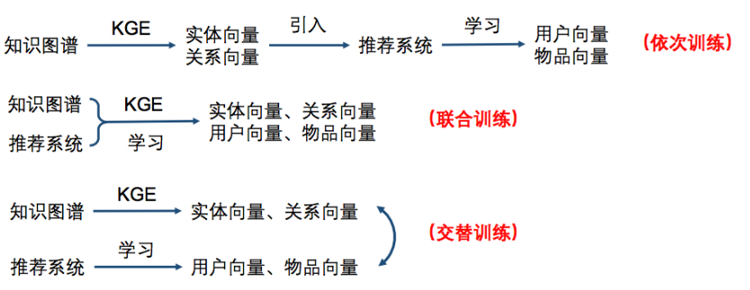

Summary
=====================
## Pipeline
`Recall` ----- Knowledge Graph -----> `Ranking` --------- Result Diversity ---------> `Final Result`


## Result diversity
* MMR (Maximal Marginal Relevance) (http://www.cs.bilkent.edu.tr/~canf/CS533/hwSpring14/eightMinPresentations/handoutMMR.pdf)
* Fast Greedy DPP (Determinantal Point Process) (http://proceedings.mlr.press/v70/han17a/han17a.pdf)


## Introduce Knowledge Graph
```

```
* Training in turn 
	* Deep Knowledge-aware Network(DKN)
* Joint training
	* Ripple Network (https://arxiv.org/pdf/1803.03467.pdf)
* Alternate training
	* Multi-task Learning for KG enhanced Recommendation(MKR)


## Document representation
* doc2vec
* `Transformer`


## Recall Approach
The goal is to collect as many correct results as possible
* DSSM:Deep Semantic Similarity Model (https://www.microsoft.com/en-us/research/wp-content/uploads/2016/02/cikm2013_DSSM_fullversion.pdf)
	* Query and Document ---> vector ( word hash embedding)
	* Deep Neural Network Projection (tanh)
	* Cosine Similarity between Query and Document ---> softmax
	* Negative Sampling while Training
	* Key Idea: project various objects to one space, then calculate distance in that space
* Matrix factorization
	* Topic
* Content Match
	* TF-IDF
